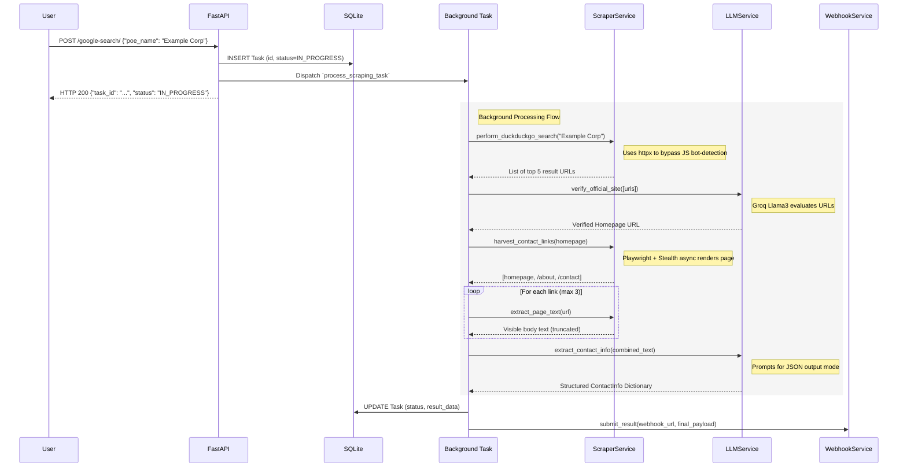

# Scraper Service Architecture

This document describes the architectural flow of the asynchronous, FastAPI-based scraping application.

## Core Technologies
- **API Framework**: FastAPI
- **Database**: SQLite (managed via SQLModel)
- **Scraping Engine**: HTTPX (Initial Search) & Playwright Async + Stealth (Deep interaction)
- **AI Extraction**: Groq API (`llama-3.3-70b-versatile`)
- **Logging**: Loguru

---

## 1. High-Level Flow Diagram

The following flowchart illustrates the entire lifecycle of a scraping request, from incoming API call to the final webhook delivery.

```mermaid
flowchart TD
    A[Client Request POST /google-search/] --> B[FastAPI Router]
    
    subgraph Initial Request
        B --> C{Create TaskRecord}
        C -->|Save to DB| D[(SQLite tasks.db)]
        C -->|Return task_id| E[Response 200 OK]
    end
    
    C -->|Trigger| F[Background Task]
    
    subgraph Async Background Process (Controlled via Semaphore)
        F --> G[Scraper Service: DuckDuckGo HTML via HTTPX]
        G --> H{Results Found?}
        
        H -->|No| I[Update Status: FAILURE]
        H -->|Yes| J[LLM Service: Verify Official Site]
        
        J --> K{Site Confirmed?}
        K -->|No| I
        K -->|Yes| L[Scraper Service: Playwright Stealth Harvest]
        
        L --> M[Extract deepest links 'contact', 'about', etc.]
        M --> N[Scraper Service: Extract Page Text Max 15k]
        
        N --> O[LLM Service: Extract Structued Data to JSON]
        O --> P[Validation success?]
        
        P -->|No| I
        P -->|Yes| Q[Update Status: SUCCESS + Data]
    end
    
    Q --> R
    I --> R[Update DB Record]
    
    R --> S[Webhook Service: Push payload to External Client]
```

---

## 2. Sequence Diagram

This sequence diagram details the interaction between the core internal services.



## 3. Package Structure

The project has been refactored into a scalable package structure:

- `app/` - Core application root
  - `api/` - Routing (`routes.py`) and Dependency Injection (`deps.py`).
  - `core/` - Application-wide configuration and settings logic (`config.py`).
  - `models/` - Pydantic request/response schemas and SQLModel database entities (`models.py`).
  - `services/` - Isolated business logic:
    - `scraper.py` (Manages Playwright browser lifecycles and HTTPX stealth searches).
    - `llm.py` (Interacts with the Groq inference engine).
    - `webhook.py` (Handles HTTP webhook pushing logic).
- `main.py` - The lightweight uvicorn entrypoint.

## 4. Concurrency Management
To prevent browser processes from overwhelming the server's RAM, the background task queue enforces a global `asyncio.Semaphore`. Even if a user throws 1,000 tasks at the POST endpoint, only `MAX_CONCURRENT_BROWSERS` (configurable via `.env`) instances will process concurrently. The rest will wait safely in the asyncio event loop queue.
