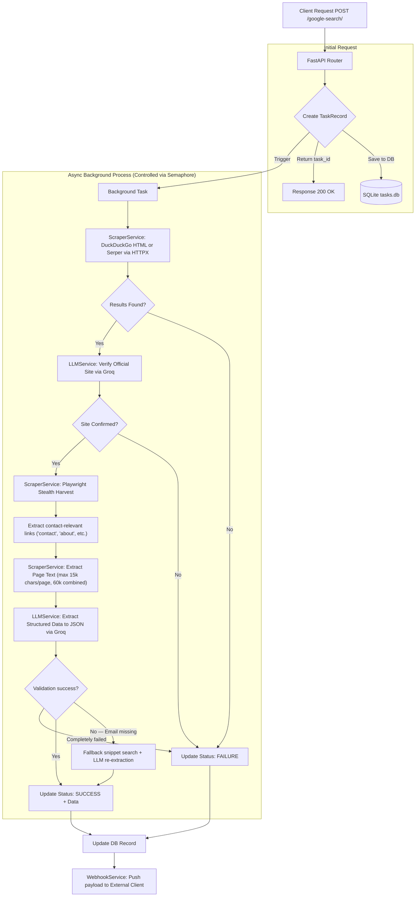
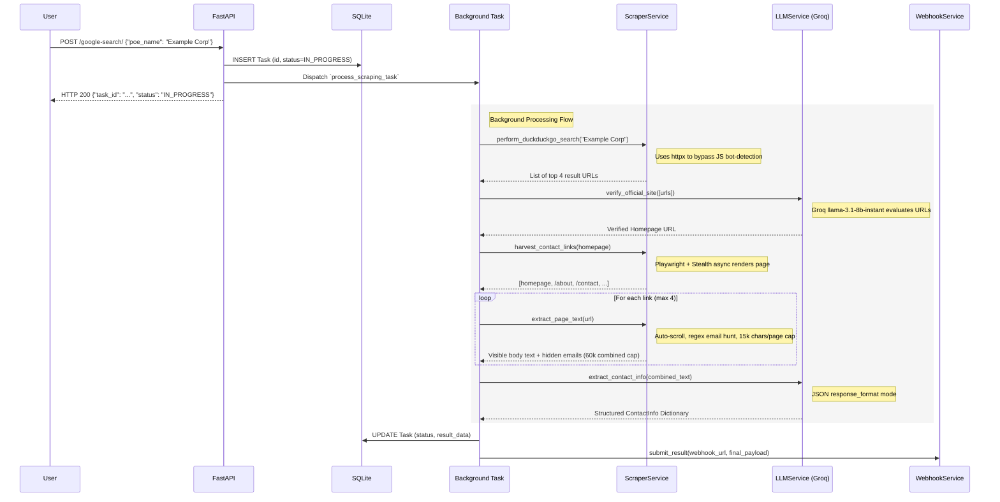

# Scraper Service Architecture

This document describes the architectural flow of the asynchronous, FastAPI-based scraping application.

## Core Technologies
- **API Framework**: FastAPI
- **Database**: SQLite (managed via SQLModel, WAL mode + 30 s busy_timeout)
- **Scraping Engine**: HTTPX (initial search) & Playwright Async + Stealth (deep page interaction)
- **AI Extraction (scraper pipeline)**: Groq API (`llama-3.1-8b-instant`)
- **AI Search (OpenAI pipeline)**: OpenAI Responses API with `web_search` tool (`gpt-4o-mini`)
- **AI Search (Gemini pipeline)**: Gemini with live Google Search grounding (`gemini-2.5-flash-lite`)
- **PDF Processing**: Gemini Files API or OpenAI vision (`pypdfium2` page rendering)
- **Logging**: Loguru (file: `scraper.log`, rotation 100 MB, retention 30 days)

---

## 1. High-Level Flow Diagram

The following flowchart illustrates the entire lifecycle of a scraping request, from incoming API call to the final webhook delivery.


```mermaid
flowchart TD
    A[Client Request POST /google-search/] --> B[FastAPI Router]
    
    subgraph Initial Request
        B --> C{Create TaskRecord}
        C -->|Save to DB| D[(SQLite tasks.db)]
        C -->|Return task_id| E[Response 200 OK]
    end
    
    C -->|Trigger| F[Background Task]
    
    subgraph "Async Background Process (Controlled via Semaphore)"
        F --> G[ScraperService: DuckDuckGo HTML or Serper via HTTPX]
        G --> H{Results Found?}
        
        H -->|No| I[Update Status: FAILURE]
        H -->|Yes| J[LLMService: Verify Official Site via Groq]
        
        J --> K{Site Confirmed?}
        K -->|No| I
        K -->|Yes| L[ScraperService: Playwright Stealth Harvest]
        
        L --> M["Extract contact-relevant links ('contact', 'about', etc.)"]
        M --> N["ScraperService: Extract Page Text (max 15k chars/page, 60k combined)"]
        
        N --> O[LLMService: Extract Structured Data to JSON via Groq]
        O --> P{Validation success?}
        
        P -->|No — Email missing| Q[Fallback snippet search + LLM re-extraction]
        Q --> R[Update Status: SUCCESS + Data]
        P -->|Yes| R
        P -->|Completely failed| I
    end
    
    R --> S[Update DB Record]
    I --> S
    
    S --> T[WebhookService: Push payload to External Client]
```

---

## 2. Sequence Diagram

This sequence diagram details the interaction between the core internal services.


```mermaid
sequenceDiagram
    participant User
    participant App as FastAPI
    participant DB as SQLite
    participant Worker as Background Task
    participant Scraper as ScraperService
    participant LLM as LLMService (Groq)
    participant Webhook as WebhookService

    User->>App: POST /google-search/ {"poe_name": "Example Corp"}
    App->>DB: INSERT Task (id, status=IN_PROGRESS)
    App->>Worker: Dispatch `process_scraping_task`
    App-->>User: HTTP 200 {"task_id": "...", "status": "IN_PROGRESS"}
    
    rect rgb(245, 245, 245)
        Note right of Worker: Background Processing Flow
        
        Worker->>Scraper: perform_duckduckgo_search("Example Corp")
        Note right of Scraper: Uses httpx to bypass JS bot-detection
        Scraper-->>Worker: List of top 4 result URLs
        
        Worker->>LLM: verify_official_site([urls])
        Note right of LLM: Groq llama-3.1-8b-instant evaluates URLs
        LLM-->>Worker: Verified Homepage URL
        
        Worker->>Scraper: harvest_contact_links(homepage)
        Note right of Scraper: Playwright + Stealth async renders page
        Scraper-->>Worker: [homepage, /about, /contact, ...]
        
        loop For each link (max 4)
            Worker->>Scraper: extract_page_text(url)
            Note right of Scraper: Auto-scroll, regex email hunt, 15k chars/page cap
            Scraper-->>Worker: Visible body text + hidden emails (60k combined cap)
        end
        
        Worker->>LLM: extract_contact_info(combined_text)
        Note right of LLM: JSON response_format mode
        LLM-->>Worker: Structured ContactInfo Dictionary
    end
    
    Worker->>DB: UPDATE Task (status, result_data)
    Worker->>Webhook: submit_result(webhook_url, final_payload)
```

---

## 3. Additional Pipelines

Beyond the core Playwright scraper, the service exposes four additional LLM-backed pipelines:

| Endpoint | Provider | Method | Output |
|---|---|---|---|
| `POST /openai-search/` | OpenAI (`gpt-4o-mini`) | Responses API + `web_search` | Tagged phones/faxes/emails/addresses |
| `POST /gemini-search/` | Gemini (`gemini-2.5-flash-lite`) | Live Google Search grounding | Tagged phones/faxes/emails/addresses |
| `POST /combined-search/` | OpenAI + Gemini (concurrent) | Both pipelines, deduplicated | Merged + summary stats |
| `POST /verify-voe/` | Gemini, OpenAI, or both | Web research + structured scoring | Confidence score + verdict |
| `POST /extract-pdf/` | Gemini Files API or OpenAI vision | Whole-PDF or page-by-page rendering | Full extracted text |
| `POST /parse-background-check/` | Gemini Files API or OpenAI vision | Two-stage extract → structure | 7 structured fields |

All async pipelines are enqueued as FastAPI `BackgroundTasks` and return a `task_id` for polling. PDF endpoints are synchronous (response returned directly).

---

## 4. Package Structure

```
app/
├── api/
│   ├── deps.py       — SQLite engine (WAL mode), get_session() dependency
│   ├── rate_limit.py — Sliding-window rate limiter (15 req/60 s per IP)
│   └── routes.py     — All endpoint definitions and background task coroutines
├── core/
│   └── config.py     — Pydantic Settings (env-file backed)
├── models/
│   └── models.py     — All Pydantic request/response schemas + SQLModel TaskRecord
└── services/
    ├── _retry.py          — Dual-layer tenacity retry factories (Gemini, OpenAI, Groq)
    ├── scraper.py         — Playwright browser lifecycle + HTTPX search methods
    ├── llm.py             — Groq inference (site verification + contact extraction)
    ├── openai_search.py   — OpenAI two-step search pipeline
    ├── gemini_search.py   — Gemini two-step search pipeline
    ├── combined_search.py — Concurrent OpenAI + Gemini merge + deduplication
    ├── voe_verification.py — Gemini employment verification
    ├── openai_voe.py      — OpenAI employment verification
    ├── pdf_extractor.py   — PDF text extraction (Gemini Files API / OpenAI vision)
    ├── bg_check_parser.py — Background check two-stage parsing pipeline
    └── webhook.py         — HTTP webhook push
main.py — Uvicorn entry point, lifespan DB init
```

---

## 5. Concurrency & Reliability

### Browser Semaphore
A global `asyncio.Semaphore(MAX_CONCURRENT_BROWSERS)` gates all Playwright tasks. Even under heavy load only `MAX_CONCURRENT_BROWSERS` (default 4, configurable via `.env`) browser instances run concurrently — the rest queue safely in the event loop.

### Rate Limiter
A per-IP sliding-window rate limiter (`rate_limit.py`) caps task-creation endpoints at **15 requests per 60 seconds**. Implemented as a FastAPI `Depends()` applied per-route (not global middleware) so health-check and polling endpoints are unaffected.

### Retry Strategy (dual-layer)
```
Layer 1 — SDK-native (inner):  OpenAI/Groq max_retries=2, Gemini HttpRetryOptions(attempts=2)
           Reads Retry-After headers; handles 429/5xx with minimal latency.
Layer 2 — tenacity (outer):    3 attempts, exponential backoff 3–60 s + jitter.
           Catches timeouts, DeadlineExceeded, and errors the SDK exhausted.

Combined ceiling: 3 (tenacity) × 3 (SDK) = 9 max API calls per logical request.
```

### SQLite Concurrency
SQLite is configured with WAL journal mode, `busy_timeout=30 000 ms`, and `synchronous=NORMAL` — allowing concurrent reads during writes and tolerating short lock contention without raising `SQLITE_BUSY` errors.
